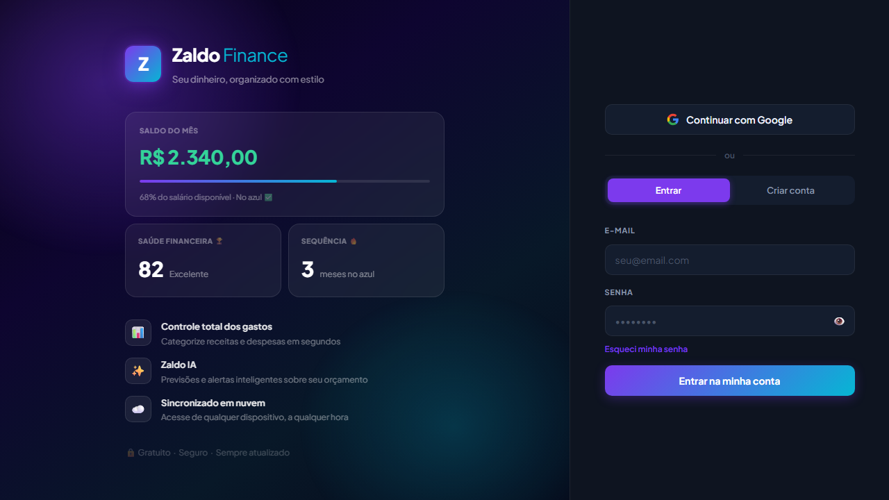
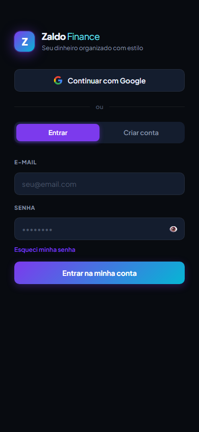

# 💜 Zaldo Finance

**Seu dinheiro, organizado com estilo.**

Zaldo Finance é um app PWA (Progressive Web App) de controle financeiro pessoal — simples, rápido e instalável no celular como um app nativo, sem custar nada.

<p align="center">
  
</p>

<p align="center">
  
</p>

## ✨ Funcionalidades

- **Dashboard mensal** — salário, gastos, saldo e investimentos com gráfico por categoria
- **Saúde financeira** — score de 0 a 100 calculado a partir do seu comportamento no mês
- **Sequência (streak)** — acompanhe quantos meses seguidos você fechou no azul
- **Zaldo IA** — projeções e alertas automáticos sobre o orçamento (ex: "salário acaba em X dias")
- **Categorias personalizadas** — além das categorias padrão, crie as suas com ícone e cor
- **Gastos recorrentes** — lançamentos que se repetem todo mês automaticamente
- **Histórico** — navegue entre meses e veja a evolução financeira
- **Resumo compartilhável** — gere um resumo do mês para copiar e enviar
- **Login com e-mail/senha ou Google**, com recuperação de senha
- **Tema claro/escuro**
- **Instalável como PWA** — funciona offline (via service worker) e pode ser adicionado à tela inicial

## 🛠️ Tecnologias

- HTML, CSS e JavaScript puro (sem frameworks/build step)
- [Firebase Authentication](https://firebase.google.com/products/auth) — login
- [Firebase Realtime Database](https://firebase.google.com/products/realtime-database) — persistência dos dados
- [Chart.js](https://www.chartjs.org/) — gráfico de gastos por categoria
- Service Worker + Web App Manifest — suporte a PWA

## 🚀 Rodando localmente

Como é um site estático, basta servir a pasta com qualquer servidor HTTP local:

```bash
npx http-server -p 8080 .
```

Depois acesse `http://localhost:8080`.

> **Importante:** o app usa um projeto Firebase próprio ([js/firebase-config.js](js/firebase-config.js)). Para rodar com seus próprios dados, crie um projeto no [Firebase Console](https://console.firebase.google.com/), ative **Authentication** (e-mail/senha e Google) e **Realtime Database**, e configure as regras de segurança para liberar acesso apenas ao próprio usuário:
>
> ```json
> {
>   "rules": {
>     "users": {
>       "$uid": {
>         ".read": "$uid === auth.uid",
>         ".write": "$uid === auth.uid"
>       }
>     }
>   }
> }
> ```
>
> Se for usar login com Google, adicione o domínio onde o app está publicado em **Authentication → Settings → Authorized domains**.

## 📁 Estrutura do projeto

```
├── index.html          # Estrutura da aplicação (login + dashboard)
├── manifest.json        # Configuração do PWA
├── sw.js                 # Service worker (cache e modo offline)
├── css/
│   └── style.css        # Estilos
├── js/
│   ├── firebase-config.js  # Configuração do Firebase
│   └── app.js              # Lógica da aplicação
└── icons/
    └── icon.svg          # Ícone do app
```

## 📄 Licença

Projeto pessoal — sem licença definida ainda.
